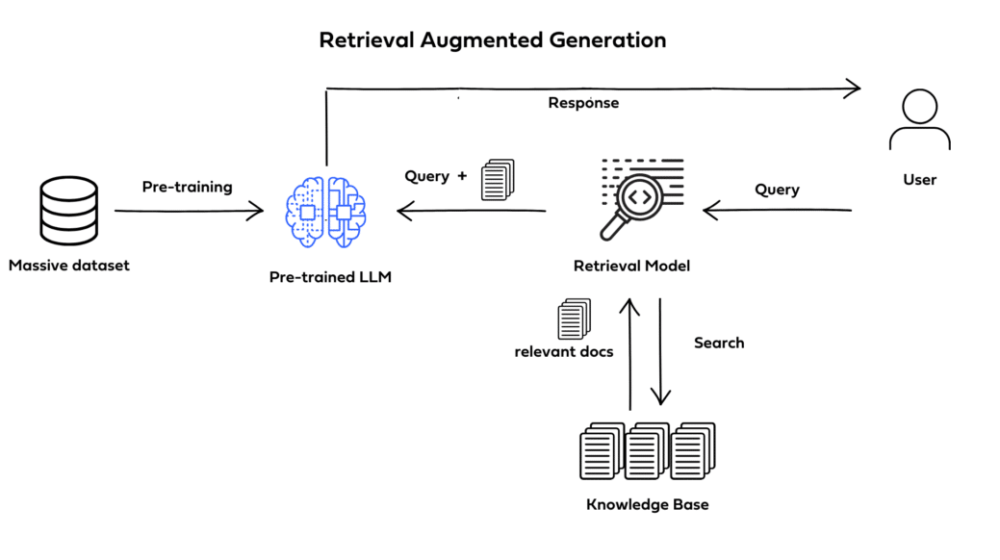

# US Criminal Code Chatbot with RAG and Llama 3


## Project Overview

This project is a **Retrieval-Augmented Generation (RAG)**-powered chatbot that allows users to query and receive responses based on the **US criminal code**. Using **Llama 3** as the foundation language model, this chatbot integrates real-time document retrieval with LLM capabilities, allowing it to dynamically access and generate responses based on specific legal documents. 

### Motivation and Use Case

Legal research is often challenging, especially when users need detailed, accurate information from a vast set of documents. Traditional search tools may return multiple pages of results, making it hard to find the most relevant sections. This project aims to streamline the process by combining document retrieval with conversational AI, giving users access to a powerful tool that:
- Provides quick, relevant responses to legal questions.
- Accesses up-to-date legal documents dynamically, ensuring accuracy.
- Enhances user experience by allowing users to interact in a chat-based format rather than performing complex document searches.

## Features

- **Interactive Chat Interface**: Engage with the system in real-time through a chat interface powered by **Gradio**.
- **Retrieval-Augmented Generation**: Enables the model to retrieve relevant legal documents on the fly, ensuring accurate responses.
- **Flexible Backend**: The code is organized into independent functions, making it adaptable for any model or dataset. 

## Getting Started

### Prerequisites

- **Python 3.8+**: Ensure you have Python installed.
- **API Access**: You'll need a free API access token from Hugging Face for the Llama 3 model or another compatible language model of your choice.

### Installation

1. **Clone the Repository**
   ```bash
   git clone https://github.com/yourusername/us-criminal-code-chatbot.git
   cd us-criminal-code-chatbot
   ```

2. **Install Dependencies**
   All required libraries are listed in the `requirements.txt` file. Use the following command to install them:
   ```bash
   pip install -r requirements.txt
   ```

3. **Set up Hugging Face API Access**
   - Register for a free API key at [Hugging Face](https://huggingface.co/).
   - Add your API key to the environment as follows:
     ```bash
     HUGGING_FACE_API_KEY="your_api_key_here"
     ```

### Running the Project

1. **Start the Interface**
   Launch the Gradio-powered interface with the following command:
   - Run the Notebook and add your model API key .

2. **Upload and Query Legal Documents**
   - Through the interface, you can upload a PDF or text document and enter queries related to the US criminal code.
   - The chatbot will process your question, retrieve relevant sections from the uploaded document, and respond with answers generated by the Llama 3 model.

### Customization

The project is designed to be model-agnostic, meaning you can use any language model that fits your needs. Simply configure the `model` parameter in the code to point to your chosen model or modify the Hugging Face API settings.

## Folder Structure

```
us-criminal-code-chatbot/
├── Chat With Your Data.pptx                    # Presentation for the project 
├── requirements.txt                            # List of dependencies
├── Q&A_Legal_App.ipynb                         # Experimental Notebook (Main)
├── responses of RAG_APP.docx                   # This is what we got through training and evaluation of the model 
└── README.md                                   # Project documentation
```

## How It Works

1. **Data Preprocessing**: Uploads are processed and indexed for efficient retrieval.
2. **Query Handling**: User queries are fed into the system, which matches them with the most relevant document sections.
3. **Response Generation**: Retrieved text is passed to the LLM, which generates a response tailored to the query based on current legal documents.

## Challenges and Limitations

- **Computational Constraints**: The quantized Llama 3 model was used due to limited resources, which may affect accuracy.
- **Interface Responsiveness**: Gradio’s single-threaded architecture required multithreading to separate the UI from background processing, improving stability under complex queries.

## Future Improvements

- **Enhanced Legal Text Support**: Adding other legal documents for a broader scope of law.
- **Improved Model Customization**: Fine-tuning the retrieval pipeline to improve accuracy in complex cases.

## Contributing

Contributions are welcome! Please submit a pull request or open an issue for any bugs or feature suggestions.

---

### License

This project is licensed under the MIT License.